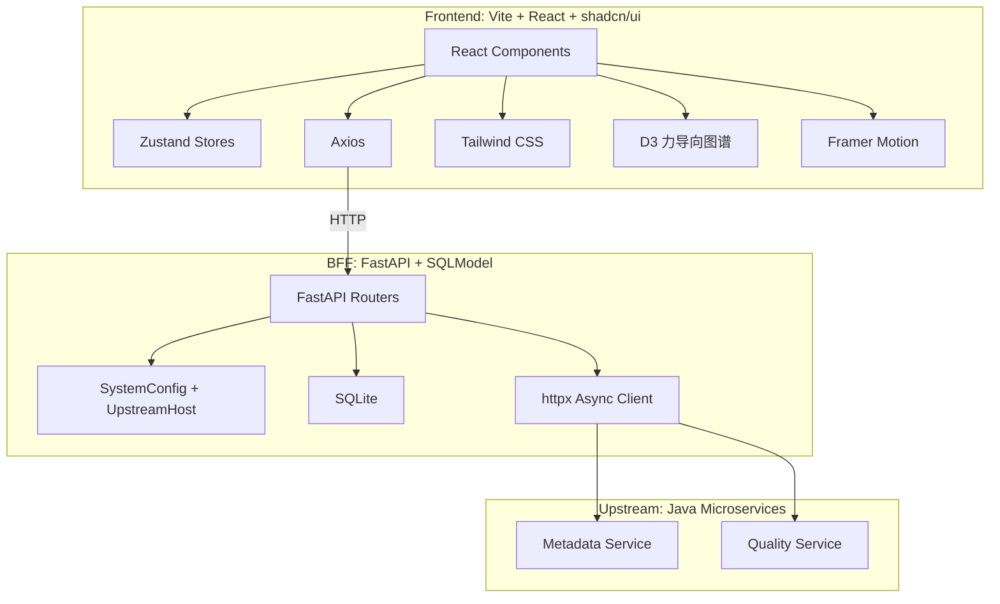

# DataMind BFF

智能化数据服务轻量级代理系统（Backend For Frontend）。

本项目作为「数据开放运营平台」的前端与底层 Java 微服务集群之间的网关层，负责接口聚合、跨域处理、请求转发以及基于 SQLite 的轻量级本地状态存储。

## 目录结构

```
.
├── backend/            # FastAPI BFF 后端服务
│   ├── main.py         # FastAPI 应用入口、路由、配置与上游主机管理
│   ├── models.py       # SQLModel 数据模型（SystemConfig、UpstreamHost）
│   ├── database.py     # SQLite 引擎与会话管理
│   ├── data/           # SQLite 数据目录（持久化）
│   ├── requirements.txt
│   ├── Dockerfile
│   └── .dockerignore
├── frontend/           # Vite + React 前端应用
│   ├── src/
│   │   ├── components/     # 业务组件
│   │   │   ├── AnalysisWorkbench.jsx   # 自助分析工作台
│   │   │   ├── GraphCanvas.jsx         # D3 力导向图谱画布
│   │   │   ├── ResourceDrawer.jsx      # 资源详情全屏抽屉
│   │   │   ├── ResultPanel.jsx         # SQL 执行结果面板
│   │   │   ├── VisualBuilder.jsx       # 可视化 SQL 构建器
│   │   │   └── ui/                     # shadcn/ui 基础组件
│   │   ├── sections/       # 页面区块
│   │   │   ├── HeroSection.jsx         # 首页门户
│   │   │   └── GraphSection.jsx        # 知识图谱页（含悬浮图层面板）
│   │   ├── stores/         # Zustand 状态管理
│   │   ├── data/           # 图谱与搜索 Mock 数据
│   │   ├── hooks/          # 自定义 Hooks
│   │   ├── lib/            # 工具函数
│   │   ├── App.jsx
│   │   ├── main.jsx
│   │   ├── index.css
│   │   └── api.js          # Axios 实例 + 502 全局拦截
│   ├── index.html
│   ├── package.json
│   ├── vite.config.js
│   ├── jsconfig.json
│   ├── components.json
│   ├── eslint.config.js
│   ├── Dockerfile
│   └── .gitignore
├── docker-compose.yml  # Docker Compose 一键启动配置
├── .gitignore
├── sdd.md              # 软件设计文档
└── README.md
```

## 技术架构



## Docker 一键启动

确保已安装 [Docker](https://www.docker.com/) 和 [Docker Compose](https://docs.docker.com/compose/)，然后在项目根目录执行：

```bash
docker compose up --build
```

启动后访问：

- 前端门户：http://localhost:3456
- 后端 API：http://localhost:8765
- Swagger UI：http://localhost:8765/docs

停止服务：

```bash
docker compose down
```

### 容器说明

- **backend**: 基于 `python:3.11-slim`，运行 FastAPI + uvicorn。
- **frontend**: 基于 Node 多阶段构建，构建后由 `serve` 托管静态资源。
- **SQLite 数据**: 通过 volume 挂载到 `./backend/data/`，实现持久化。

## 前端

### 技术栈

- React 19 + Vite
- React Router v7
- Zustand（状态管理）
- Axios（数据请求）
- Tailwind CSS v4 + shadcn/ui
- D3（力导向图谱）
- Framer Motion（动画与拖拽）
- recharts（数据可视化）
- @monaco-editor/react（SQL 编辑器）
- Sonner（Toast 提示）

### 已实现的前端功能

- **首屏 Hero 门户**：居中搜索框、快捷入口卡片（自助分析 / 自助开发），底部可下钻至全景图谱。
- **航贸知识图谱**：
  - 基于 D3 力导向图展示业务流程节点与数据资源节点；
  - 支持拖拽、缩放、Hover 高亮、单击打开资源详情、双击展开/收起字段级节点；
  - 节点文字外置为浮动标签，连线文字以中点浮动卡片展示，标签大小不随画布缩放变化；
  - 字段节点以小圆圈形式围绕父节点环形布局；
  - 深色玻璃态悬浮图层面板，支持拖拽、折叠、hover 呼吸感，不占据画布空间。
- **图层导航面板**：统计实体/关系数量、L1/L2/L3 层级切换、节点类型与关系类型图例、字段明细折叠浮层。
- **资源详情全屏抽屉**：从中心缩放弹出，左侧资产档案 + 右侧主工作区；不同资源类型展示对应详情（表、指标、API、数据集）。
- **服务类型（API）处理**：隐藏数据质量分，将「自助分析/自助开发」合并为「服务申请」，接口详情以 QPS 等调用指标替代 P99 延迟。
- **数据质量探查**：基于 recharts 展示完整性、唯一性、一致性、及时性评分，以及字段空值率柱状图和枚举值分布饼图。
- **权限审批**：点击「自助开发/服务申请」时在抽屉顶部内联展示权限申请流程。
- **自助分析工作台**：全屏 IDE，左侧 Schema 资产树、中部 Monaco SQL 编辑器、底部结果面板，支持表/字段智能补全与可视化构建。
- **外部跳转**：首页「自助开发」与自助分析页「前往可视化分析」通过 `window.open` 跳转至外部系统，不在项目内嵌。

### 502 错误全局拦截

`frontend/src/api.js` 中配置了 Axios 响应拦截器：

- 当后端返回 502 状态码时，自动通过 Sonner 展示错误提示。
- 错误文案优先使用后端返回的 `detail` 字段，默认显示“系统当前繁忙，请稍后重试”。

### 本地开发

```bash
cd frontend
npm install
npm run dev
```

前端默认运行在 http://localhost:5173

```bash
npm run lint
npm run build
```

## 后端

### 技术栈

- Python 3.11 + FastAPI
- SQLModel（ORM + Pydantic 数据校验）
- httpx（异步 HTTP 客户端）
- SQLite（仅存储本地配置，不存储核心业务数据）

### API 契约

#### 获取系统配置

```
GET /api/v1/config/{config_key}
```

响应示例：

```json
{
  "config_key": "java_api_timeout",
  "config_value": "5000",
  "is_active": true
}
```

> **说明**：`GET /api/v1/data-service/overview` 等 Java 业务代理接口暂未实现，后续按需补充。`UpstreamHost` 与 `httpx.AsyncClient` 已准备就绪。

### 多 Java Host 支持

为支持多个上游 Java 服务主机，后端新增 `UpstreamHost` 模型：

```python
class UpstreamHost(SQLModel, table=True):
    id: Optional[int] = Field(default=None, primary_key=True)
    name: str = Field(description="主机别名")
    host_url: str = Field(description="Java 服务基础地址")
    is_active: bool = Field(default=True, description="是否生效")
```

启动时会自动初始化默认主机（可通过环境变量 `JAVA_HOST` 覆盖），后续业务接口可从该表中读取生效主机列表进行路由或负载均衡。

### 异常与降级

- 调用 Java 服务默认超时 5 秒，可通过 SQLite 中 `java_api_timeout` 配置项动态调整（单位：毫秒）。
- 若 Java 服务不可用或超时，BFF 返回 HTTP 502 状态码，错误格式统一为：

```json
{
  "detail": "底层服务连接失败: [具体原因]",
  "code": "ERR_UPSTREAM_TIMEOUT"
}
```

### 本地开发

```bash
cd backend
pip install -r requirements.txt
uvicorn main:app --reload --port 8765
```

后端默认运行在 http://127.0.0.1:8765

### API 文档

启动服务后访问：

- Swagger UI: http://127.0.0.1:8765/docs
- ReDoc: http://127.0.0.1:8765/redoc

## 与 SDD 设计文档对照

### 已符合项

- 前端：React + Vite，Zustand 状态管理，Axios 请求，Tailwind CSS + shadcn/ui
- 后端：Python 3.11 + FastAPI，httpx 异步客户端，SQLModel ORM
- 存储：SQLite 仅用于本地配置，不存储核心业务数据
- 数据模型：`SystemConfig`、`UpstreamHost` 与 SDD 定义一致
- API 契约：`GET /api/v1/config/{config_key}` 已实现
- 异常处理：前端 Axios 502 拦截 + Sonner 提示；后端已准备 502 错误格式

### 待实现 / 偏差项

- `GET /api/v1/data-service/overview` 等 Java 业务代理接口暂未实现（已按需求延后）。
- 前端容器化当前使用 Node `serve` 托管静态资源；SDD 原要求为 Nginx Alpine，因网络环境调整为 `serve`。
- 自助分析工作台、航贸知识图谱可视化交互为扩展功能，不在原 SDD 范围内。

## License

This project is licensed under the MIT License.
